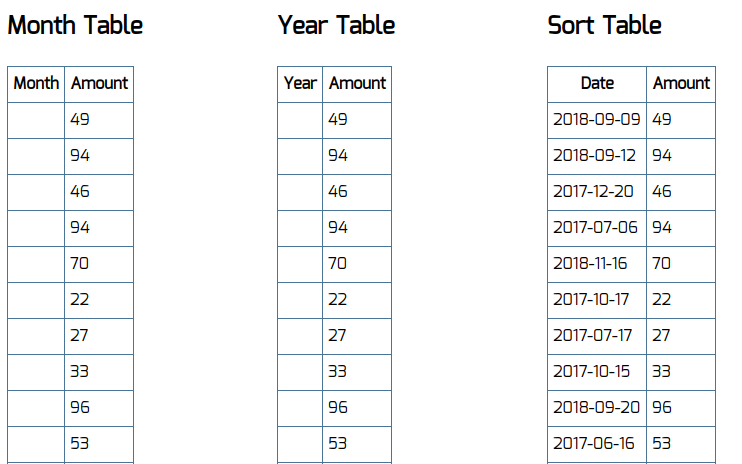

<a name="top"></a>
# Агрегация данных для таблиц

[вернуться в корневой readme](../README.md)


- [Задание](#задание)
- [Решение](#решение)

## Задание
Есть набор из трёх компонентов, которые выводят табличные данные:
- с группировкой по месяцам за текущий год,
- с группировкой по годам,
- с сортировкой по убыванию.  

  
К сожалению, эти компоненты работают только с подготовленными данными, а API сервера статистики возвращает нам сырые данные — неотсортированные и несгруппированные.  
Данные запрашиваются один раз (https://raw.githubusercontent.com/netology-code/ra16-homeworks/master/hoc/aggregation/data/data.json) — после загрузки страницы.
```json
{
  "list": [
    {"date": "2018-01-13", "amount": 10},
    {"date": "2018-02-13", "amount": 9},
    {"date": "2018-01-09", "amount": 5},
    {"date": "2017-12-14", "amount": 14},
    {"date": "2018-03-01", "amount": 13},
    //...
  ]
}
```
## Реализация
Обернуть компоненты таблиц в HOC, который бы производил над данными операции, приводящие их к нужному виду. Также данные, которые группируются по дате, должны быть отсортированы по ней.

Компонент MonthTable ожидает данные в свойство list в следующем формате:
```js
[{month: "Jan", amount: 100}, ...]
```
Компонент YearTable ожидает данные в свойство list в следующем формате:
```js
[{year: 2018, amount: 100}, ...]
```
Компонент SortTable ожидает данные в свойство list в следующем формате:
```js
[{date: "2017-12-14", amount: 14}, ...]
```

[Вверх](#top)

## Решение

Аггрегирование я понял как суммирование по какому-то критерию. В таблице месяцев странное ТЗ, предполагалось суммирование по январям всех годов?  
Бизнесу интереснее было бы посмотреть на сводные данные по месяцам разных лет.

Логика работы:
1. Универсальность базовых компонентов
    1. Поправлена верстка в таблицах базовых компонентов для улучшения семантики (и React ругается в консоли, если у table нет tbody).
    2. Поправлены ожидаемые значения в таблицах базовых компонентов, они ждут date и amount
2. Изначальный основной компонент App, состоящий из трех компонентов, обернут в AppView для передачи данных в пропсе и сверху в AppLoader для обеспечения возможности загрузки данных.
3. Данные загружаются с сети и предварительно сортируются по полю date от старого к новому. Создана универсальная функция аггрегирования через reduce, использована в двух компонентах.
4. Компоненты-обертки для базовых компонентов дневной, месячной и годовой таблиц (рука не поднимается назвать их HOC) получают в пропсах загруженные данные,  аггрегируют данные по соответствующему критерию и передают результат в базовые компоненты. 

Результат - таблица итогов по месяцам разных лет, таблица итогов по разным годам и таблица по разным дням. Везде записи отсортированы по дате.

Скриншот результата:  


[Вверх](#top)