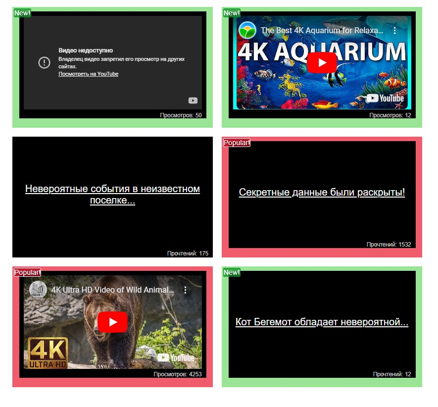

# Подсвечивание блоков

[вернуться в корневой readme](../README.md)

- [Задание](#задание)
- [Решение](#решение)

## Задание
На нашем сайте есть блоки со статьями и с видеозаписями.  
  
Мы решили улучшить отображение наших блоков таким образом, чтобы популярные статьи и видео, у которых 1000+ прочтений или просмотров, оборачивались в компонент Popular, а с количеством до 100 — в компонент New. Эти компоненты будут менять внешний облик блоков, привлекая внимание посетителей.

## Реализация
Используя HOC, обернуть Video и Article таким образом, чтобы при отображении в компоненте List они помещались внутрь требуемого компонента Popular или New.

[Вверх](#top)

## Решение

Вот бы в 2025 году задание, связанное с Ютубом давать... :)

Создан компонент высшего порядка для обертки компонента, передаваемого в качесвте аргумента, в компонент New или Popular.
Можно было бы сделать универсальный компонент и вычислять тип (Video или Article) внутри HOC-компонента, но тогда, на мой взгляд, 
снизится "чистота" и читаемость этого HOC.
Можно было бы применить каррирование, но тогда пропадет присвоение свойства WrappedComponent.displayName, и на это заругается eslint.   

Скриншот результата:  

[Вверх](#top)