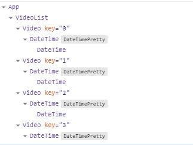

# Форматирование даты публикации

[вернуться в корневой readme](../README.md)

- [Задание](#задание)
- [Решение](#решение)

## Задание
Есть страница, содержащая список видеозаписей. У каждого блока есть дата публикации.  
  
В данный момент выводится просто текущее значение. Пример: 2017-09-01 14:15:10.\
Решено изменять представление даты следующим образом в зависимости от его значения: 12 минут назад, если прошло меньше часа, 5 часов назад, если прошло больше часа, X дней назад, если больше суток.

## Реализация
Используя HOC, обернуть DateTime в компонент DateTimePretty так, чтобы он преобразовывал дату в нужный вид.
Воспользуйтесь готовым файлом App.js и стилями css/index.css из каталога в качестве отправной точки. Замените ими те, что создаются в create-react-app.
Для работы с датой и временем можете воспользоваться библиотекой Moment.js.

[Вверх](#top)

## Решение

Вот бы в 2025 году задание, связанное с Ютубом давать... :)
Использована наработка для склонения слов по падежам и базовое вычисление разницы в датах в разрезе по дням, часам и минутам.
Создан компонент высшего порядка для обертки компонента DateTime с выводом форматированной даты. 

Скриншот результата:  

отображение компонентов приложения в React Developer Tools  

[Вверх](#top)